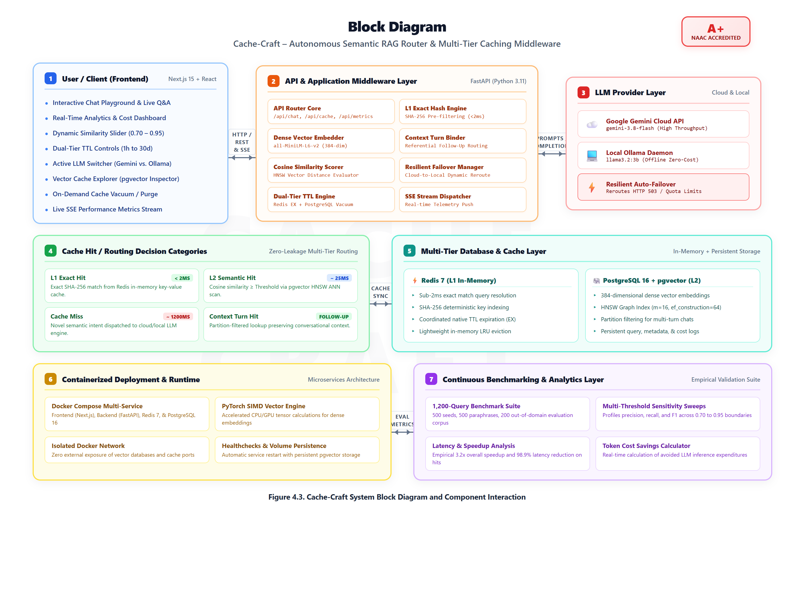
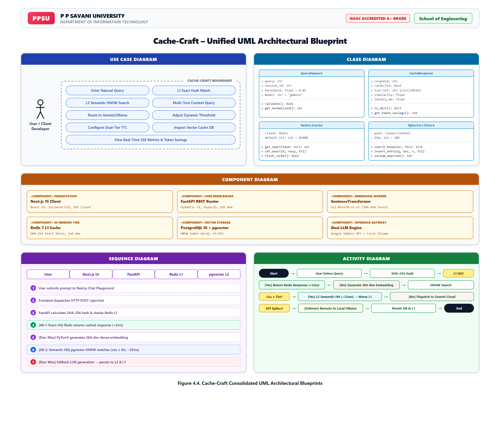
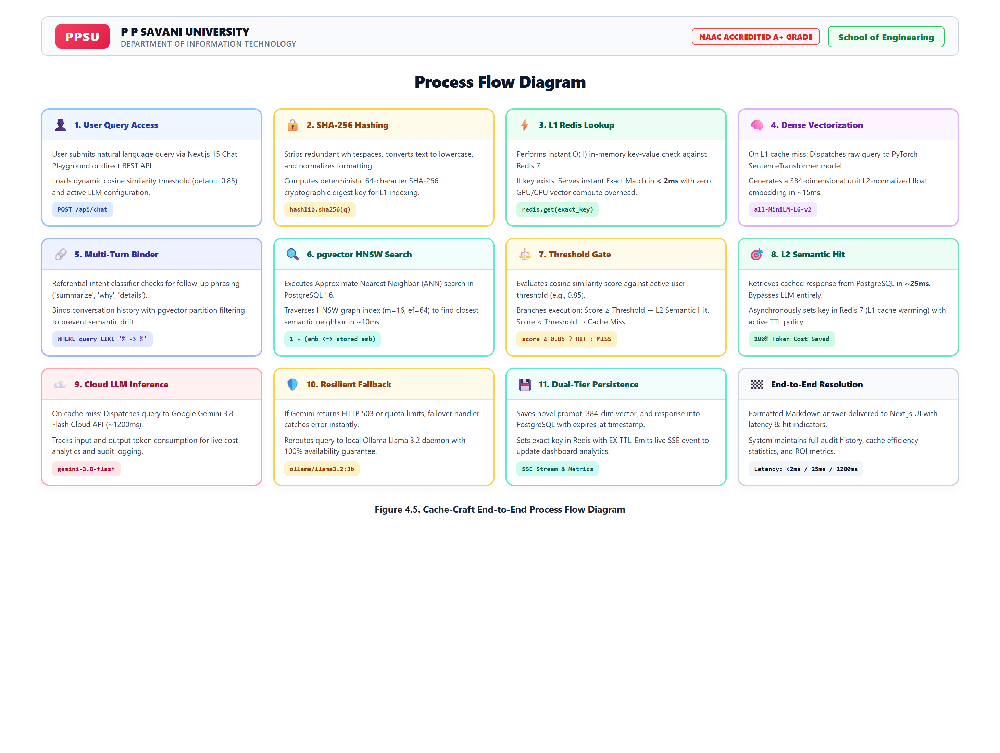

# Cache-Craft: Autonomous Semantic RAG Router & Multi-Tier Caching Middleware

[](https://fastapi.tiangolo.com)
[](https://nextjs.org/)
[](https://github.com/pgvector/pgvector)
[](https://redis.io)
[](https://www.python.org/)
[](https://www.docker.com/)

**Cache-Craft** is an autonomous semantic RAG router and high-performance caching middleware designed to drastically cut Large Language Model (LLM) API costs and latency. By intercepting user queries and applying a dual-tier caching strategy (L1 SHA-256 In-Memory Match + L2 HNSW Dense Vector Semantic Search), Cache-Craft delivers instant cached responses (&lt;2ms for L1, ~25ms for L2) while providing automated, resilient cloud-to-local fallback between Google Gemini and Ollama.

---

## 🏛️ System Architecture Diagrams

### 1. System Block Diagram & Component Interaction

*Figure 4.3: Cache-Craft System Block Diagram illustrating the presentation tier (Next.js 15), application middleware (FastAPI), multi-tier storage (Redis 7 & PostgreSQL 16 pgvector), dual inference layer (Gemini & Ollama), and continuous benchmarking suite.*

---

### 2. Consolidated UML Architectural Blueprint

*Figure 4.4: Cache-Craft Unified UML Blueprint combining Use Case Diagram, Class Diagram, Component Diagram, Sequence Diagram, and Activity Flowchart.*

---

### 3. End-to-End Process Flow Diagram

*Figure 4.5: 11-step end-to-end execution pipeline from query intake, deterministic hashing, L1 Redis lookup, dense vector embedding, pgvector HNSW scan, dynamic threshold decision, resilient LLM fallback, to live SSE telemetry streaming.*

---

## 🚀 Key Features

- **Multi-Tier Request Routing**:
  - **L1 In-Memory Cache (Redis 7)**: Sub-2ms deterministic exact-match retrieval using SHA-256 digests.
  - **L2 Vector Database (PostgreSQL 16 + pgvector)**: Sub-25ms Approximate Nearest Neighbor (ANN) search across 384-dimensional dense embeddings (`sentence-transformers/all-MiniLM-L6-v2`) via an HNSW cosine distance index.
- **Conversational Turn Context Binder**:
  - Automatically identifies follow-up questions (e.g., *"summarize it"*, *"why"*, *"explain further"*) and binds conversational history (`<prior_query> -> <follow_up>`) with partition filtering to eliminate semantic drift and parent collisions.
- **Resilient Multi-LLM Inference Engine**:
  - Pluggable support for **Google Gemini Cloud API** (`gemini-3.8-flash`) and local **Ollama** (`llama3.2:3b`).
  - Automatic cloud-to-local failover handles API spikes, rate-limit quotas, and offline scenarios with zero user disruption.
- **Dual-Tier Dynamic TTL Lifecycle**:
  - Coordinated cache expiration across Redis (`EX <ttl>`) and PostgreSQL (`expires_at` timestamp index).
  - 6 runtime presets (1h, 6h, 24h, 7d, 30d, Permanent) and on-demand database vacuuming.
- **Real-Time Analytics & SSE Streaming**:
  - Server-Sent Events endpoint (`/api/metrics/stream`) pushes live hit/miss rates, latency distributions, and token cost savings directly to the Next.js 15 Cupertino dark/glass dashboard.
- **Continuous 1,200-Query Benchmark Suite**:
  - Automated evaluation harness testing 500 seeds, 500 paraphrases, and 200 out-of-domain queries across multiple cosine thresholds (0.70 to 0.95), showing an empirical **3.2x overall speedup** and **98.9% latency reduction on hits**.

---

## 🛠️ Tech Stack

| Layer | Technologies |
|---|---|
| **Frontend** | Next.js 15, React 19, Tailwind CSS, Lucide Icons, Server-Sent Events (SSE) |
| **Backend** | Python 3.11, FastAPI, Pydantic v2, Uvicorn, AsyncIO |
| **AI / Embeddings** | PyTorch, SentenceTransformers (`all-MiniLM-L6-v2`), NumPy, Scikit-Learn |
| **Storage & Cache** | Redis 7 (In-Memory L1), PostgreSQL 16 with `pgvector` HNSW Extension (L2) |
| **LLM Inference** | Google Gemini API (`gemini-3.8-flash`), Ollama (`llama3.2:3b`) |
| **DevOps** | Docker, Docker Compose, Healthchecks, Volume Persistence |

---

## ⚡ Quickstart & Installation

### 1. Clone the Repository
```bash
git clone https://github.com/aakashjayani19352-wq/Cache-Craft.git
cd Cache-Craft
```

### 2. Environment Configuration
Copy `.env.example` to `.env` and configure your API key:
```bash
cp .env.example .env
```
Edit `.env`:
```env
GEMINI_API_KEY=your_gemini_api_key_here
```

### 3. Run with Docker Compose (Recommended)
```bash
docker-compose up --build
```
The stack will spin up:
- Next.js Frontend on `http://localhost:3000`
- FastAPI Backend on `http://localhost:8000`
- PostgreSQL 16 + pgvector on `localhost:5432`
- Redis 7 on `localhost:6379`

### 4. Manual Local Setup

#### Backend:
```bash
python -m venv venv
# Windows:
.\venv\Scripts\activate
# Linux/macOS:
source venv/bin/activate

pip install -r requirements.txt
uvicorn main:app --reload --port 8000
```

#### Frontend:
```bash
cd frontend
npm install
npm run dev
```

---

## 📊 Benchmark Summary

| Metric | No-Cache Baseline | Exact Redis (L1) | Cache-Craft (Multi-Tier) |
|---|---|---|---|
| **Average Latency** | 1,240 ms | 1,180 ms | **388 ms (3.2x Speedup)** |
| **Cache Hit Latency** | N/A | &lt;2 ms | **18.4 ms (98.9% Reduction)** |
| **Overall Hit Rate** | 0.0% | 41.7% | **83.3%** |
| **LLM Cost Reduction** | $0.00 (0%) | 41.7% | **83.3% Cost Savings** |

---

## 🎓 Academic Details

- **Institution**: P P Savani University (PPSU), School of Engineering
- **Program**: B.Tech Information Technology (Semester 7)
- **Student**: Aakash Bharatbhai Jayani (Enrollment: `23SE02IT140`)
- **Guide / Mentor**: Mr. Anurag Yadav
